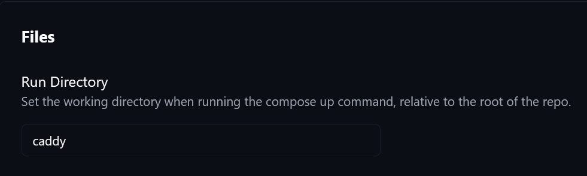
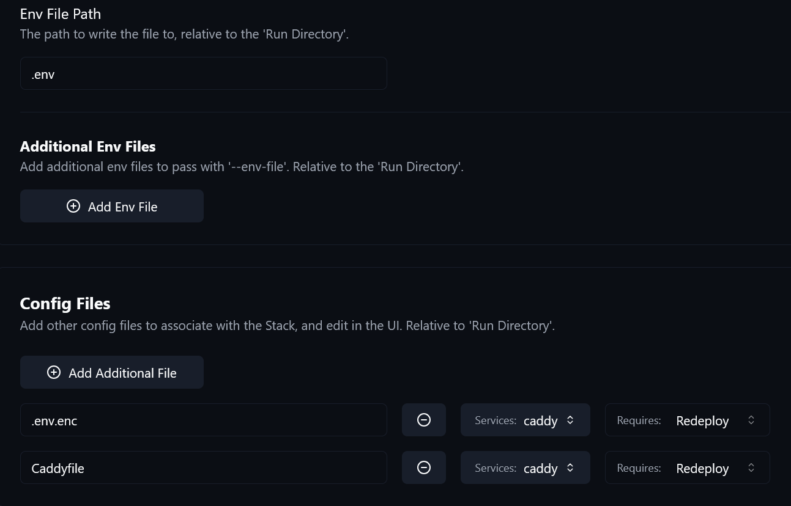
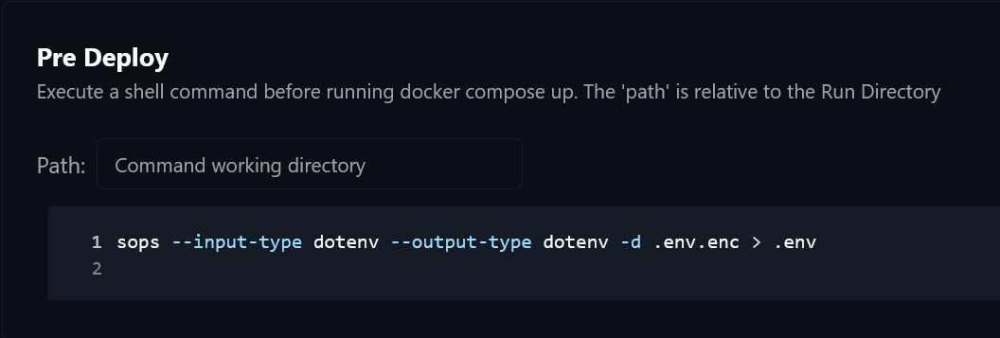

# SOPS, age, File Watcher, Komodo, and Unraid

## Overview

This repository is designed around encrypted stack environment files. You edit a
local `.env`, your editor workflow turns it into `.env.enc`, and Komodo
decrypts that file again on the host right before deployment.

The repository keeps `.env.example` as the shared template for each stack.
Your own deployment keeps the real values in `.env` locally and `.env.enc` in
Git.

## Local File Watcher Setup

Install the VS Code extension:

- [File Watcher on the Visual Studio Marketplace](https://marketplace.visualstudio.com/items?itemName=appulate.filewatcher)

This workflow also expects the folder `.vscode/.scripts` to exist in the
repository and to contain these two PowerShell scripts:

- `encrypt-env.ps1`
- `decrypt-env.ps1`

The provided setup is intended for Windows. If you want to use the same workflow
on another operating system, you will need equivalent scripts or another local
automation approach.

A possible alternative is the VS Code extension
[signageOS SOPS](https://marketplace.visualstudio.com/items?itemName=signageos.signageos-vscode-sops).
That may be a better fit if you want an editor-based SOPS workflow without the
PowerShell script setup above.

Add these commands to your VS Code user settings:

```json
"filewatcher.commands": [
  {
    "cmd": "pwsh -NoProfile -File \"${workspaceRoot}\\.vscode\\.scripts\\encrypt-env.ps1\" -InputFile \"${file}\"",
    "event": "onFileChange",
    "isAsync": true,
    "match": ".env"
  },
  {
    "cmd": "pwsh -NoProfile -File \"${workspaceRoot}\\.vscode\\.scripts\\decrypt-env.ps1\" -InputFile \"${file}\"",
    "event": "onFileChange",
    "isAsync": true,
    "match": "\\.env\\.enc$"
  }
]
```

That gives you this workflow:

- editing `.env` updates `.env.enc`
- editing `.env.enc` recreates a local decrypted file for inspection
- Git tracks `.env.enc`, while `.env` stays ignored

## Key Material

The same `keys.txt` material must exist on:

- the workstation that encrypts `.env`
- the Komodo host that decrypts `.env.enc`

If those age identities differ, local encryption and host-side decryption stop
matching.

## Komodo Stack Pattern

Each Komodo-managed stack follows the same deployment model:

- `Run Directory` points to the stack folder, for example `caddy`
- `Config Files` includes `.env.enc`
- `Requires` is set to `Redeploy`
- `Pre Deploy` decrypts `.env.enc` back to `.env`

Example Komodo configuration for a stack such as `caddy`:

### Run Directory



### Env File and Config Files

In this example, Komodo writes the runtime env file to `.env` and tracks
additional stack files such as `.env.enc` and `Caddyfile` as redeploy-relevant
config files.



### Pre Deploy

```sh
sops --input-type dotenv --output-type dotenv -d .env.enc > .env
```



Possible alternative when working directly with a SOPS-managed `.env` file:

```sh
sops decrypt -i .env
```

That alternative has not been tested in this setup.

## Unraid and Repo Paths

If your Komodo host runs on Unraid, check any stack that mounts files from the
repository checkout by absolute host path. A current example is the `caddy`
stack:

```yaml
/srv/appdata/komodo/repos/homelab/caddy/Caddyfile
```

Using `KOMODO_REPO_NAME` keeps the path configurable if your Komodo checkout
directory differs from the default.

For repo-backed stacks, verify that:

- `Run Directory` still resolves relative to the repo checkout
- `Config Files` still reference `.env.enc`
- `Pre Deploy` still decrypts inside the stack working directory
- no host-side mounts or hooks still point at an outdated repo path

## Webhook and Redeploy Flow

The normal deployment flow is:

1. push a change to the repository
2. GitHub notifies Komodo through the configured webhook
3. Komodo updates the checkout on the host
4. the stack decrypts `.env.enc` during `Pre Deploy`
5. Komodo runs the redeploy

## Cloudflared Option

If your Komodo instance needs a public endpoint for GitHub webhooks, the
`cloudflared` stack is the optional way to expose that listener without opening
direct inbound access to the host.
