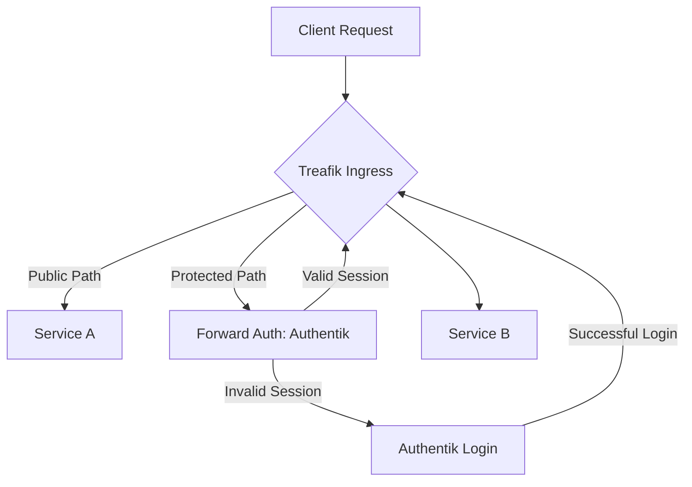

## Overview

This document outlines the planned integration of [Authentik](https://goauthentik.io/) as the identity provider for single sign-on (SSO) across internal services, utilizing [Traefik](./traefik-as-ingress.md) as the ingress controller with forward authentication.

## Current State

<!-- openwiki: broken internal link [./stacks/authentik/README.md] file "./stacks/authentik/README.md" does not exist. Fix the href or restore the target, then delete this comment. -->
According to the [Authentik stack README](./stacks/authentik/README.md):
> This stack is not yet in active use in the current homelab deployment.
<!-- openwiki: broken internal link [../traefik/README.md] file "../traefik/README.md" does not exist. Fix the href or restore the target, then delete this comment. -->
> The full configuration and integration with [`traefik`](../traefik/README.md) is planned for the coming weeks.

<!-- openwiki: broken internal link [./stacks/traefik/README.md] file "./stacks/traefik/README.md" does not exist. Fix the href or restore the target, then delete this comment. -->
The [Traefik stack README](./stacks/traefik/README.md) describes Traefik as the core ingress, routing, and edge security stack, but does not currently mention forward-auth configuration. The planned integration will add forward-auth middleware to protect services.

## Planned Integration Architecture

The integration will follow this pattern:

1. **Traefik** acts as a reverse proxy and terminates TLS for incoming requests.
2. For services requiring authentication, Traefik will invoke an external authentication service (forward-auth) before routing the request to the backend.
3. **Authentik** will be configured as the forward-auth service, validating user sessions, credentials, and permissions.
4. Upon successful authentication, Traefik will proceed to route the request to the target service, passing along user information via headers.
5. Unauthenticated or unauthorized requests will be redirected to Authentik's login flow or denied with an appropriate HTTP status.



### Key Components

- **Traefik Forward Auth Middleware**: Configured to call Authentik's `/if/auto/` endpoint (or equivalent) for session validation.
- **Authentik Configuration**:
  - An application representing Traefik (or individual services) configured with the appropriate protocol (OAuth2/OpenID Connect or LDAP, depending on service requirements).
  - A forward-auth provider (or embedded login) that Traefik can query.
  - Policy engine to enforce group-based or attribute-based access control.
- **Service Integration**: Services either trust headers passed by Traefik (e.g., `X-Authentik-Username`, `X-Authentik-Groups`) or perform their own validation using tokens issued by Authentik.

## Dependencies

- **Traefik Configuration**: Requires enabling the forward-auth middleware and pointing it to Authentik's validation endpoint. This will likely involve:
  - Adding a middleware definition in Traefik's dynamic configuration (e.g., via `rules/` directory or Docker labels).
  - Ensuring the middleware is applied to appropriate routers (typically `chain-external` or service-specific routers).
- **Authentik Deployment**: The Authentik stack (`postgresql`, `server`, `worker`) must be deployed and healthy.
- **Network Connectivity**: Traefik must be able to reach the Authentik service internally (likely via Docker network or service discovery).
- **User Directory**: Authentik must be connected to a user source (e.g., LDAP, internal database) for authentication.

## Configuration Notes

### Traefik Side

A typical forward-auth middleware configuration in Traefik (YAML) might resemble:

```yaml
http:
  middlewares:
    authentik-forward-auth:
      forwardAuth:
        address: http://authentik-server:9000/if/auto/
        trustForwardHeader: true
        authResponseHeaders:
          - X-Authentik-Username
          - X-Authentik-Email
          - X-Authentik-Groups
```

This middleware would then be attached to routers protecting specific services.

### Authentik Side

- Create an **Application** in Authentik with:
  - **Provider Type**: `oauth2` (or `proxy` for header-based auth, depending on Traefik configuration).
  - **Redirect URIs**: Set appropriately if using OAuth2 flows (though forward-auth typically uses the `/if/auto/` endpoint which may not require redirects).
  - **Authorization Login/Redirection URLs**: Point to Authentik's login page.
- Ensure the **Provider** is configured to issue the necessary headers or tokens expected by Traefik and the downstream services.
- Set up **Policies** to control access based on groups, attributes, or other criteria.

## Relationship to Other Documentation

- See [Traefik as Ingress](./traefik-as-ingress.md) for details on the Traefik stack and its role.
<!-- openwiki: broken internal link [../architecture/identity-and-access.md] file "../architecture/identity-and-access.md" does not exist. Fix the href or restore the target, then delete this comment. -->
- See [Identity and Access](../architecture/identity-and-access.md) for the broader architectural context of identity management in the homelab.
<!-- openwiki: broken internal link [./stacks/authentik/README.md] file "./stacks/authentik/README.md" does not exist. Fix the href or restore the target, then delete this comment. -->
<!-- openwiki: broken internal link [./stacks/traefik/README.md] file "./stacks/traefik/README.md" does not exist. Fix the href or restore the target, then delete this comment. -->
- Refer to the [Authentik stack README](./stacks/authentik/README.md) and [Traefik stack README](./stacks/traefik/README.md) for deployment specifics.

## Open Questions and Future Work

- Determine the exact Authentik endpoint and configuration for optimal forward-auth performance and security.
- Decide whether to use OAuth2, OpenID Connect, or a simple header-based proxy pattern for service integration.
- Plan for logging and monitoring of authentication events via Traefik and Authentik.
- Test the integration with representative services (e.g., Homepage, other internal tools) before broader rollout.
