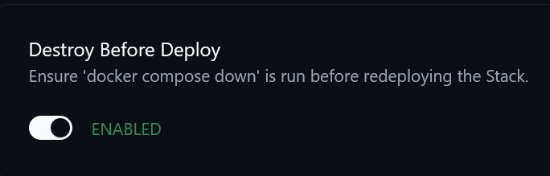

# SABnzbd + Gluetun

> Usenet download stack paired with VPN routing and recovery automation hooks

## Stack Role

This stack directory stores the `compose.yaml`, `README.md`, and tracked `.env.example` for `sabnzbd`. For the encrypted deployment workflow with SOPS, age, File Watcher, and Komodo, see [`docs/sops-age-komodo.md`](../docs/sops-age-komodo.md).

## Services

- `gluetun`
- `sabnzbd`

## Upstream

### `gluetun`

- Website: [https://github.com/qdm12/gluetun](https://github.com/qdm12/gluetun)
- GitHub: [https://github.com/qdm12/gluetun](https://github.com/qdm12/gluetun)

### `sabnzbd`

- Website: [https://sabnzbd.org/](https://sabnzbd.org/)
- GitHub: [https://github.com/sabnzbd/sabnzbd](https://github.com/sabnzbd/sabnzbd)

## Related Links

- Related automation: monitor_sab_speed: [https://github.com/smoochy/homelab-automation-scripts/tree/main/media/sabnzbd/monitor_sab_speed](https://github.com/smoochy/homelab-automation-scripts/tree/main/media/sabnzbd/monitor_sab_speed)
- Related automation: extract_iso: [https://github.com/smoochy/homelab-automation-scripts/tree/main/media/sabnzbd/extract_iso](https://github.com/smoochy/homelab-automation-scripts/tree/main/media/sabnzbd/extract_iso)
- Related automation: delete_item_from_history: [https://github.com/smoochy/homelab-automation-scripts/tree/main/media/sabnzbd/delete_item_from_history](https://github.com/smoochy/homelab-automation-scripts/tree/main/media/sabnzbd/delete_item_from_history)

## Komodo Notes

This stack needs one additional Komodo consideration because `sabnzbd` depends
on the `gluetun` container.

If `gluetun` gets redeployed on its own, the old container disappears and
`sabnzbd` can still remain attached to that no longer existing container
instance. In practice, that means a `gluetun` update is not complete unless
`sabnzbd` is redeployed as well.

For that reason, configure the stack in Komodo so a `gluetun` update forces a
redeploy of `sabnzbd` too.

### Example service dependency configuration

### Example redeploy requirement

