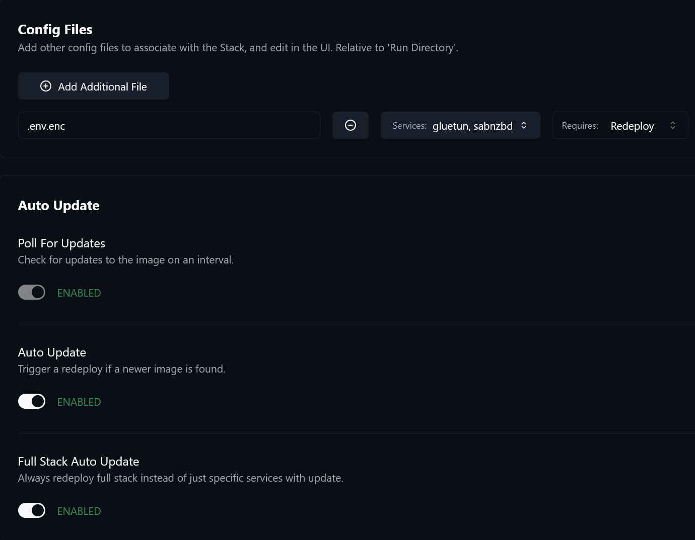
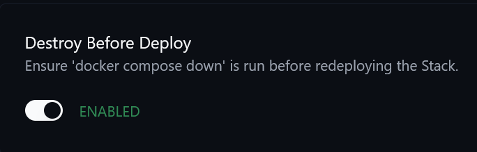

# SABnzbd + Gluetun

> Usenet download stack paired with VPN routing and recovery automation hooks

## Stack Role

This stack directory stores the `compose.yaml`, `README.md`, and tracked `.env.example` for `sabnzbd`.

## Services

- `gluetun`
- `sabnzbd`
- `whatpulse`

## Upstream

### `gluetun`

- Website: [https://github.com/qdm12/gluetun](https://github.com/qdm12/gluetun)
- GitHub: [https://github.com/qdm12/gluetun](https://github.com/qdm12/gluetun)

### `sabnzbd`

- Website: [https://sabnzbd.org/](https://sabnzbd.org/)
- GitHub: [https://github.com/sabnzbd/sabnzbd](https://github.com/sabnzbd/sabnzbd)

### `whatpulse`

- Website: [https://whatpulse.org/](https://whatpulse.org/)
- GitHub: [https://github.com/whatpulse/linux-external-pcap-service](https://github.com/whatpulse/linux-external-pcap-service)

## WhatPulse Rider

The `whatpulse` service is a WhatPulse client sharing `gluetun`'s network namespace, because inbound bytes are attributed only where the connection terminates: a download that ends inside the VPN namespace is counted nowhere else. It captures the namespace's `eth0` rather than the tunnel device, which carries no MAC address and is therefore invisible to the client. The noVNC front end is the only way to log the client in on a server with no desktop, and the link survives a recreate through the persisted data directory.

Its data directory is `/mnt/user/appdata/sabnzbd-whatpulse`, beside the SABnzbd appdata directory rather than inside it. The image mounts `/mnt/user/appdata/sabnzbd` as `/config` and chowns that tree to its own `PUID`/`PGID` on every start, which takes any subdirectory with it; the client runs as uid 1000 and then reports its own database as read-only, never opens its listener and counts nothing while the container stays healthy.

This stack also holds the image recipe both riders build - `whatpulse/Dockerfile` and `whatpulse/entrypoint.sh`, plus the `seccomp-no-packet-ring.json` profile that pins the capture to one interface. The qBittorrent stack runs the second rider and builds this same context through a relative path, carrying its own copy of the profile because Compose resolves that path against each compose file's own directory; the two copies have to be edited together. Both build blocks carry a `SRC_REV` marker over this context, so a change to the image moves both compose files and Komodo redeploys both stacks. Bump it with `scripts/src-rev.sh`.

## Scripts

- [Download Speed Monitor and Recovery Script](./scripts/monitor_sab_speed/README.md): Host-side throughput monitoring with controlled recovery paths for slow SABnzbd runs.
- [ISO Extractor Post-Processing Script](./scripts/extract_iso/README.md): SABnzbd post-processing helper that extracts ISO payloads and removes the source image afterwards.
- [Delete Items From History Scripts](./scripts/delete_item_from_history/README.md): Queue-based cleanup helpers for selected SABnzbd history categories.
- [upPollo Staging Post-Processing Script](./scripts/uppollo_stage/README.md): Captures the original release name of a finished job and filters it down to what the tracker permits.

## Komodo Notes

This stack needs one additional Komodo consideration because `sabnzbd` depends
on the `gluetun` container.

If `gluetun` gets redeployed on its own, the old container disappears and
`sabnzbd` can still remain attached to that no longer existing container
instance. In practice, that means a `gluetun` update is not complete unless
`sabnzbd` is redeployed as well.

For that reason, configure the stack in Komodo so a `gluetun` update forces a
redeploy of `sabnzbd` too.

### Example service dependency configuration

### Example redeploy requirement

